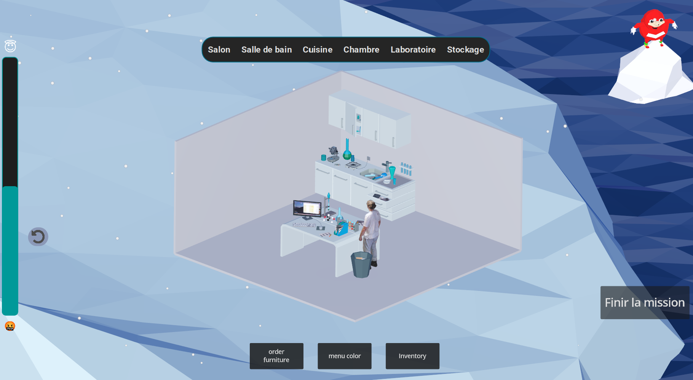
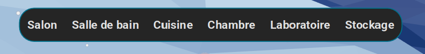
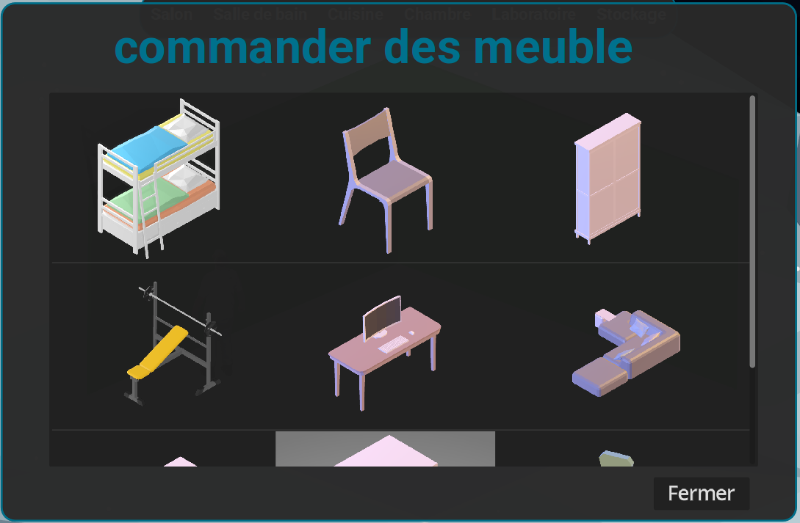
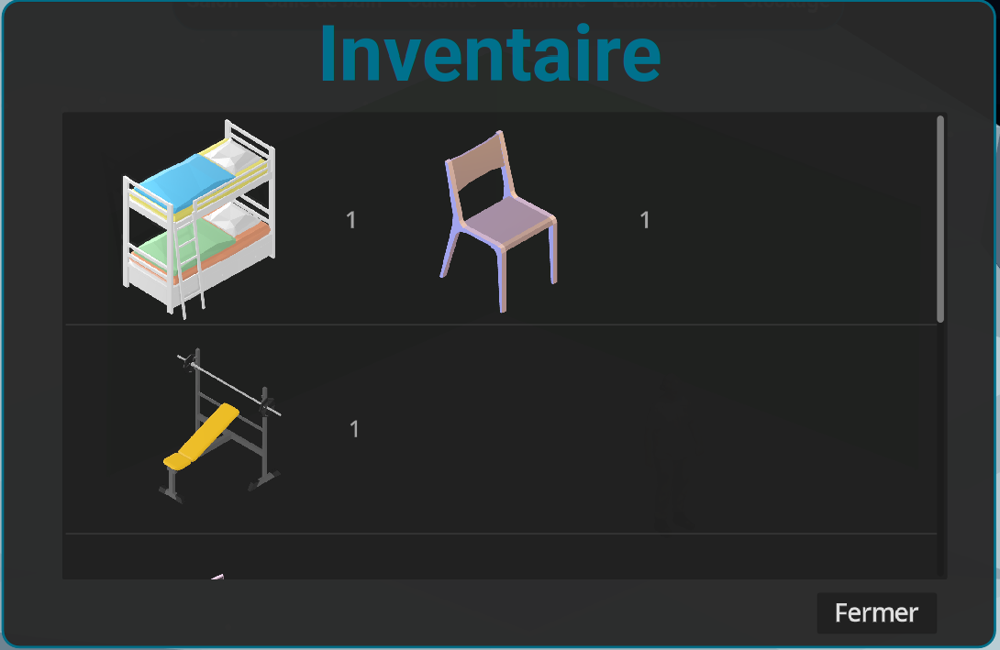
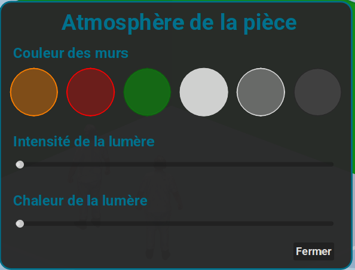

# Beyond the Ice

Beyond the Ice est un jeu éducatif développé avec le moteur Godot dans le cadre d’un projet universitaire.  
Le projet combine un jeu de gestion en environnement polaire avec une plateforme web Laravel permettant d’enregistrer les résultats et le score des joueurs.

## Description

Le projet met l’accent sur :  
- la conception logicielle (UML, architecture modulaire)  
- la gestion de projet (PERT, Gantt, découpage en tâches)  
- un gameplay basé sur la gestion d’un espace, l’interaction avec des objets et le comportement de PNJ  
- l’apprentissage et l’utilisation du moteur Godot  
- un accompagnement web via un site Laravel permettant la sauvegarde et la consultation des scores

Le joueur peut modifier la pièce (changer la couleur des murs, ajouter ou retirer des meubles), et les NPC réagissent dynamiquement à ces changements.  
Les actions du joueur influencent la satisfaction des NPC, la progression, et le score final, envoyé vers la plateforme web.

### Description plus complete : 
[Description.md](Description.md)
  

## explication 

### partie centrale
piece dans laquelle le joueur peut agir

### partie gauche 
barre de satisfaction moyenne de tous les NPC de la base

# menus
### partie superieur 
naviguer entre les salles grace a des boutons 

### partie inferieur
commander des meubles :

 
inventaire :

 
changer la couleur des mur et la luminosité :
 

 

## Technologies / Stack

- Godot Engine (4.x)  
- GDScript  
- Laravel (backend pour les scores)  
- SQLite  
- UML diagrams  
- PERT / Gantt  
- Git & GitHub  
- (En cours) Docker pour conteneurisation du jeu + du site web

## Installation & Lancement

Voir le fichier : [INSTALL.md](INSTALL.md)

## Fonctionnalités / Features

### Implémentées
- Structure complète du projet Godot  
- Architecture des scènes / nodes  
- Système de navigation des NPC  
- Réactions dynamiques des NPC aux actions du joueur  
- Ajout / suppression de meubles en temps réel  
- Changement de la couleur des murs  
- Calcul du score  
- API Laravel pour enregistrer les résultats

## Roadmap / Planned Work

Les tâches en cours incluent :  
- Conteneurisation des applications (jeu + backend Laravel)  
- Génération aléatoire de décor / niveaux  
- Refonte du tutoriel  
- Création du menu principal et interface complète  
- Système jour/nuit  
- Système d’éclairage  
- Amélioration du comportement des NPC (éviter obstacles, collisions, etc.)  
- Ajout de nouveaux meubles  
- Limite de 4 meubles par pièce  
- Bouton “Fin de partie” + écran de récapitulatif  
- Optimisations générales

## Notes

Projet réalisé dans le cadre d’un travail d’équipe universitaire.  
Le jeu et le site web évoluent régulièrement.
